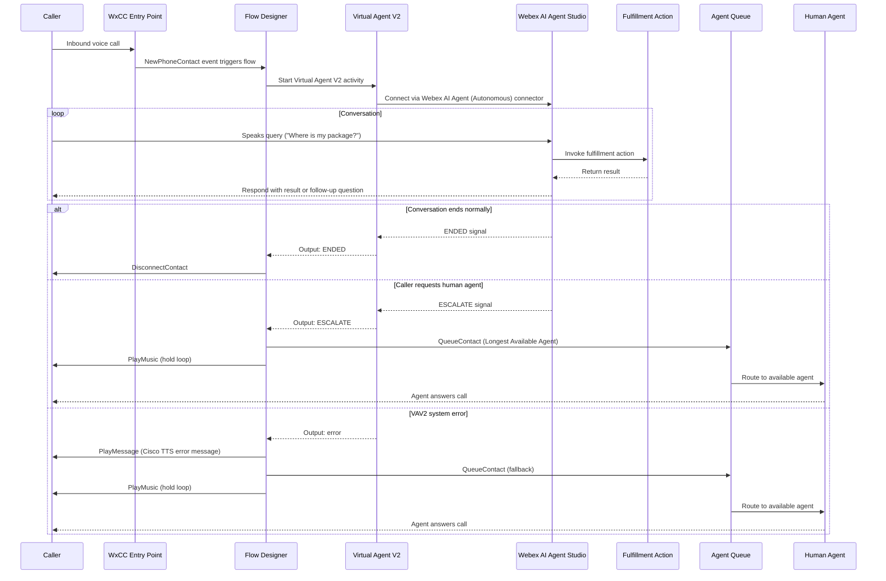
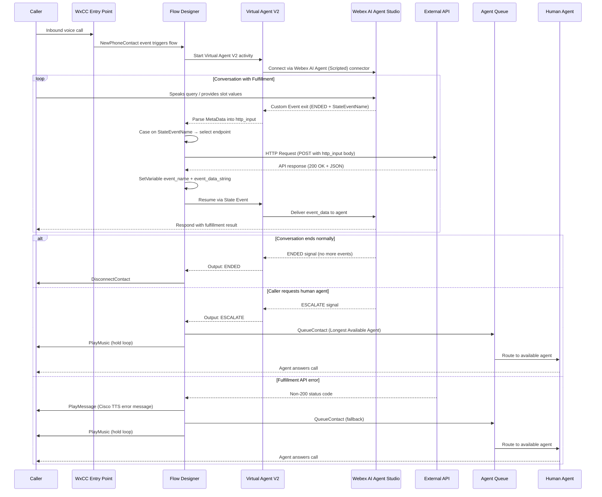

# Solution Docs — Quick Reference

## HTML Theme

### CSS Variables

```css
:root {
  --cisco-blue: #049FD9;
  --cisco-dark: #0D274D;
  --dark-bg: #0f1419;
  --card-bg: #1a1f25;
  --card-border: #2a3040;
  --text-primary: #e8edf2;
  --text-secondary: #8b99a8;
  --green: #1bb34c;
  --orange: #ff8c00;
  --red: #e84d3d;
}
```

### Full Inline CSS

```css
@import url('https://fonts.googleapis.com/css2?family=Inter:wght@300;400;500;600;700&display=swap');

:root {
  --cisco-blue: #049FD9;
  --cisco-dark: #0D274D;
  --dark-bg: #0f1419;
  --card-bg: #1a1f25;
  --card-border: #2a3040;
  --text-primary: #e8edf2;
  --text-secondary: #8b99a8;
  --green: #1bb34c;
  --orange: #ff8c00;
  --red: #e84d3d;
}

* { margin: 0; padding: 0; box-sizing: border-box; }

body {
  font-family: 'Inter', -apple-system, sans-serif;
  background: var(--dark-bg);
  color: var(--text-primary);
  line-height: 1.6;
}

.hero {
  background: linear-gradient(135deg, var(--cisco-dark) 0%, #0a1628 100%);
  padding: 4rem 2rem;
  text-align: center;
  border-bottom: 3px solid var(--cisco-blue);
}

.hero h1 {
  font-size: 2.8rem;
  font-weight: 700;
  color: var(--cisco-blue);
  margin-bottom: 0.5rem;
  letter-spacing: -0.02em;
}

.hero .subtitle {
  font-size: 1.3rem;
  color: var(--text-secondary);
  font-weight: 300;
}

.hero .tagline {
  margin-top: 1.5rem;
  display: inline-block;
  background: rgba(4, 159, 217, 0.12);
  border: 1px solid rgba(4, 159, 217, 0.3);
  padding: 0.5rem 1.5rem;
  border-radius: 100px;
  font-size: 0.95rem;
  color: var(--cisco-blue);
  font-weight: 500;
}

.container {
  max-width: 1200px;
  margin: 0 auto;
  padding: 2rem;
}

.section {
  margin-bottom: 3rem;
}

.section-header {
  display: flex;
  align-items: center;
  gap: 1rem;
  margin-bottom: 1.5rem;
}

.section-number {
  background: var(--cisco-blue);
  color: white;
  width: 40px;
  height: 40px;
  border-radius: 10px;
  display: flex;
  align-items: center;
  justify-content: center;
  font-weight: 700;
  font-size: 1.1rem;
  flex-shrink: 0;
}

.section-header h2 {
  font-size: 1.6rem;
  font-weight: 600;
  color: var(--text-primary);
}

.section-desc {
  color: var(--text-secondary);
  font-size: 0.95rem;
  margin-bottom: 1.5rem;
  padding-left: 3.5rem;
}

.diagram-card {
  background: var(--card-bg);
  border: 1px solid var(--card-border);
  border-radius: 16px;
  padding: 2.5rem;
  overflow-x: auto;
}

.diagram-card .mermaid {
  display: flex;
  justify-content: center;
}

.diagram-card .mermaid svg {
  max-width: 100%;
  height: auto;
}

.summary-row {
  display: grid;
  grid-template-columns: repeat(auto-fit, minmax(250px, 1fr));
  gap: 1rem;
  margin-bottom: 3rem;
}

.summary-card {
  background: var(--card-bg);
  border: 1px solid var(--card-border);
  border-radius: 12px;
  padding: 1.5rem;
  border-top: 3px solid var(--cisco-blue);
}

.summary-card.green { border-top-color: var(--green); }
.summary-card.orange { border-top-color: var(--orange); }
.summary-card.red { border-top-color: var(--red); }

.summary-card h3 {
  font-size: 1rem;
  font-weight: 600;
  margin-bottom: 0.5rem;
  color: var(--text-primary);
}

.summary-card p {
  font-size: 0.88rem;
  color: var(--text-secondary);
  line-height: 1.5;
}

.key-detail {
  display: inline-block;
  font-family: 'SF Mono', 'Fira Code', monospace;
  font-size: 0.82rem;
  color: var(--cisco-blue);
  background: rgba(4, 159, 217, 0.08);
  padding: 0.3rem 0.7rem;
  border-radius: 6px;
  margin-top: 0.75rem;
}

.divider {
  height: 1px;
  background: linear-gradient(90deg, transparent, var(--card-border), transparent);
  margin: 3rem 0;
}

.footer {
  text-align: center;
  padding: 2rem;
  color: var(--text-secondary);
  font-size: 0.85rem;
  border-top: 1px solid var(--card-border);
}

.comparison-table {
  width: 100%;
  border-collapse: collapse;
  font-size: 0.9rem;
}

.comparison-table th {
  background: var(--cisco-blue);
  color: white;
  padding: 0.75rem 1rem;
  text-align: left;
  font-weight: 600;
  border: 1px solid var(--cisco-blue);
}

.comparison-table td {
  background: var(--card-bg);
  color: var(--text-primary);
  padding: 0.75rem 1rem;
  border: 1px solid var(--card-border);
  line-height: 1.5;
}

.comparison-table tr:hover td {
  background: rgba(4, 159, 217, 0.06);
}

.comparison-table code {
  font-family: 'SF Mono', 'Fira Code', monospace;
  font-size: 0.82rem;
  color: var(--cisco-blue);
  background: rgba(4, 159, 217, 0.08);
  padding: 0.15rem 0.4rem;
  border-radius: 4px;
}

.code-block {
  font-family: 'SF Mono', 'Fira Code', monospace;
  font-size: 0.8rem;
  color: var(--text-primary);
  background: rgba(0, 0, 0, 0.3);
  padding: 1rem;
  border-radius: 8px;
  line-height: 1.6;
  white-space: pre;
  overflow-x: auto;
  margin-top: 0.75rem;
}

@media print {
  body { background: white; color: #1a1f25; }
  .hero { background: white; border-bottom-color: #049FD9; }
  .hero h1 { color: #049FD9; }
  .hero .subtitle, .section-desc, .summary-card p, .footer { color: #555; }
  .diagram-card, .summary-card { border-color: #ddd; background: #fafafa; }
  .section { page-break-inside: avoid; }
}
```

### Mermaid Initialization

```javascript
mermaid.initialize({
  startOnLoad: true,
  theme: 'dark',
  securityLevel: 'loose',
  flowchart: {
    useMaxWidth: true,
    htmlLabels: true,
    curve: 'basis',
    padding: 20,
    nodeSpacing: 30,
    rankSpacing: 40
  },
  sequence: {
    useMaxWidth: true,
    actorMargin: 80,
    messageMargin: 40,
    mirrorActors: false,
    bottomMarginAdj: 10,
    showSequenceNumbers: false
  }
});
```

### Mermaid Theme Variables

**Flowchart (`graph TB`):**
```
%%{init: {'theme': 'dark', 'themeVariables': { 'primaryColor': '#1a2744', 'primaryTextColor': '#e8edf2', 'primaryBorderColor': '#049FD9', 'lineColor': '#4a5568', 'secondaryColor': '#0D274D', 'tertiaryColor': '#1a1f25', 'edgeLabelBackground': '#1a1f25', 'clusterBkg': '#0D274D', 'clusterBorder': '#2a3040', 'titleColor': '#049FD9' }}}%%
```

**Sequence diagram:**
```
%%{init: {'theme': 'dark', 'themeVariables': { 'actorTextColor': '#e8edf2', 'actorBorder': '#049FD9', 'actorBkg': '#1a2744', 'signalColor': '#e8edf2', 'labelBoxBkgColor': '#0D274D', 'labelBoxBorderColor': '#049FD9', 'labelTextColor': '#e8edf2', 'loopTextColor': '#e8edf2', 'activationBorderColor': '#049FD9', 'activationBkgColor': '#1a2744', 'sequenceNumberColor': '#049FD9', 'noteBkgColor': '#0D274D', 'noteBorderColor': '#2a3040', 'noteTextColor': '#e8edf2' }}}%%
```

### Node Style Overrides

```
style SUCCESS_NODE fill:#1bb34c,stroke:#158f3a,color:#fff
style FAILURE_NODE fill:#e84d3d,stroke:#c43a2d,color:#fff
style KEY_NODE fill:#049FD9,stroke:#0380b0,color:#fff
style WARNING_NODE fill:#cc7000,stroke:#b36200,color:#fff
```

### Reference Diagram: Voice Agent Architecture (Autonomous)

Canonical sequence diagram for autonomous AI agent voice flows. Adapted from the [Cisco reference implementation](https://github.com/webex/WebexPlaybooks/tree/main/playbooks/wxcc-ai-agent-autonomous). Replace example utterances and action names with the specific solution's details.



### Reference Diagram: Voice Agent Architecture (Scripted with Fulfillment)

For scripted agents, the fulfillment loop happens in Flow Designer via the State Event resume pattern. Adapted from the [Cisco scripted appointment reference](https://github.com/webex/WebexPlaybooks/tree/main/playbooks/wxcc-ai-agent-scripted-appointment).



---

## HTML Section Templates

### Hero

```html
<div class="hero">
  <h1>{TITLE}</h1>
  <p class="subtitle">{SUBTITLE}</p>
  <div class="tagline">{TAG1} &middot; {TAG2} &middot; {TAG3}</div>
</div>
```

### Summary Row (4 cards)

```html
<div class="summary-row" style="margin-top: 2rem;">
  <div class="summary-card">
    <h3>The Problem</h3>
    <p>{problem description}</p>
  </div>
  <div class="summary-card green">
    <h3>The Solution</h3>
    <p>{solution description}</p>
  </div>
  <div class="summary-card orange">
    <h3>{Update/Verify Mechanism}</h3>
    <p>{how data gets updated or verified}</p>
    <div class="key-detail">{key API endpoint or variable}</div>
  </div>
  <div class="summary-card red">
    <h3>{Routing Mechanism}</h3>
    <p>{how calls/messages get routed}</p>
    <div class="key-detail">{key lookup or filter}</div>
  </div>
</div>
```

### Numbered Section with Diagram

```html
<div class="section">
  <div class="section-header">
    <div class="section-number">{N}</div>
    <h2>{Section Title}</h2>
  </div>
  <p class="section-desc">{One-line description}</p>
  <div class="diagram-card">
    <pre class="mermaid">
    {mermaid diagram code}
    </pre>
  </div>
</div>
```

### Numbered Section with Summary Cards

```html
<div class="section">
  <div class="section-header">
    <div class="section-number">{N}</div>
    <h2>{Section Title}</h2>
  </div>
  <div class="summary-row">
    <div class="summary-card">
      <h3>{Card Title}</h3>
      <p>{Card content}</p>
      <div class="key-detail">{optional key detail}</div>
    </div>
    <!-- repeat for each card -->
  </div>
</div>
```

### Numbered Section with Table

```html
<div class="section">
  <div class="section-header">
    <div class="section-number">{N}</div>
    <h2>{Section Title}</h2>
  </div>
  <p class="section-desc">{description}</p>
  <div class="diagram-card">
    <table class="comparison-table">
      <thead>
        <tr><th>{Col1}</th><th>{Col2}</th><th>{Col3}</th></tr>
      </thead>
      <tbody>
        <tr><td>{val}</td><td><code>{val}</code></td><td>{val}</td></tr>
      </tbody>
    </table>
  </div>
</div>
```

### Numbered Section with Code Block

```html
<div class="section">
  <div class="section-header">
    <div class="section-number">{N}</div>
    <h2>{Section Title}</h2>
  </div>
  <p class="section-desc">{description}</p>
  <div class="diagram-card">
    <div class="code-block">{preformatted code}</div>
  </div>
</div>
```

### Divider

```html
<div class="divider"></div>
```

### Footer

```html
<div class="footer">
  {Plan Title} &middot; Solution Architecture &middot; {Key Technologies}
</div>
```

---

## PPTX Specifications

### Slide Dimensions

```python
from pptx.util import Inches, Pt, Emu
from pptx.dml.color import RGBColor
from pptx.enum.shapes import MSO_SHAPE

prs = Presentation()
prs.slide_width = Emu(12191695)   # 13.33 inches
prs.slide_height = Emu(6858000)   # 7.50 inches
```

### Color Palette

| Name | Hex | RGBColor | Usage |
|---|---|---|---|
| Dark Background | #1A1F25 | `RGBColor(0x1A, 0x1F, 0x25)` | Slides 1, 3, 7, 9, 10 |
| Light Background | #FFFFFF | `RGBColor(0xFF, 0xFF, 0xFF)` | Slides 2, 4, 5, 6, 8 |
| Cisco Blue | #049FD9 | `RGBColor(0x04, 0x9F, 0xD9)` | Titles, headers, key elements |
| Card Dark 1 | #222830 | `RGBColor(0x22, 0x28, 0x30)` | Table row even, gotcha cards |
| Card Dark 2 | #2A3038 | `RGBColor(0x2A, 0x30, 0x38)` | Table row odd |
| Detail Box | #0A3D5C | `RGBColor(0x0A, 0x3D, 0x5C)` | Solution detail, bottom info boxes |
| Problem Pink | #FEF3F2 | `RGBColor(0xFE, 0xF3, 0xF2)` | Problem statement box |
| Green | #1BB34C | `RGBColor(0x1B, 0xB3, 0x4C)` | Success, final step |
| Green Light | #E8F5E9 | `RGBColor(0xE8, 0xF5, 0xE9)` | Success step background |
| Orange | #FF8C00 | `RGBColor(0xFF, 0x8C, 0x00)` | Warning, retry |
| Red | #E84D3D | `RGBColor(0xE8, 0x4D, 0x3D)` | Error, critical warning |
| Architecture Green | #2D8C5A | `RGBColor(0x2D, 0x8C, 0x5A)` | Input/source box |
| Architecture Orange | #E86E2C | `RGBColor(0xE8, 0x6E, 0x2C)` | Output/destination box |
| Gray Light | #F5F5F5 | `RGBColor(0xF5, 0xF5, 0xF5)` | Neutral step cards |
| Blue Light | #E3F2FD | `RGBColor(0xE3, 0xF2, 0xFD)` | Secondary step cards |
| Info Box Light | #F8F9FA | `RGBColor(0xF8, 0xF9, 0xFA)` | Detail/info boxes on light slides |
| White Text | #FFFFFF | `RGBColor(0xFF, 0xFF, 0xFF)` | Text on dark backgrounds |
| Dark Text | #333333 | `RGBColor(0x33, 0x33, 0x33)` | Text on light backgrounds |
| Secondary Text Dark | #A0AEC0 | `RGBColor(0xA0, 0xAE, 0xC0)` | Subtitles on dark backgrounds |
| Secondary Text Light | #666666 | `RGBColor(0x66, 0x66, 0x66)` | Subtitles on light backgrounds |

### Font

Calibri throughout. Sizes:

| Element | Size | Bold | Color (dark bg) | Color (light bg) |
|---|---|---|---|---|
| Slide title | 32pt | No | Cisco Blue | Cisco Blue |
| Subtitle | 16pt | No | #A0AEC0 | #666666 |
| Card title | 14pt | Yes | White | #333333 |
| Card body | 11pt | No | #A0AEC0 | #666666 |
| Table header | 12pt | Yes | White | — |
| Table cell | 11pt | No | White/secondary | — |
| Tagline | 14pt | No | #A0AEC0 | — |
| Monospace detail | 10pt | No | Cisco Blue | — |

### Rounded Rectangle Helper

```python
def add_rounded_rect(slide, left, top, width, height, fill_color, text="", font_size=Pt(11), font_color=RGBColor(0xFF, 0xFF, 0xFF), bold=False):
    shape = slide.shapes.add_shape(
        MSO_SHAPE.ROUNDED_RECTANGLE, left, top, width, height
    )
    shape.fill.solid()
    shape.fill.fore_color.rgb = fill_color
    shape.line.fill.background()
    shape.adjustments[0] = 0.1
    if text:
        tf = shape.text_frame
        tf.word_wrap = True
        tf.margin_left = Inches(0.15)
        tf.margin_right = Inches(0.15)
        tf.margin_top = Inches(0.1)
        tf.margin_bottom = Inches(0.1)
        p = tf.paragraphs[0]
        p.text = text
        p.font.size = font_size
        p.font.color.rgb = font_color
        p.font.name = "Calibri"
        p.font.bold = bold
    return shape
```

### Text Box Helper

```python
def add_text_box(slide, left, top, width, height, text, font_size=Pt(11), font_color=RGBColor(0xFF, 0xFF, 0xFF), bold=False):
    txBox = slide.shapes.add_textbox(left, top, width, height)
    tf = txBox.text_frame
    tf.word_wrap = True
    p = tf.paragraphs[0]
    p.text = text
    p.font.size = font_size
    p.font.color.rgb = font_color
    p.font.name = "Calibri"
    p.font.bold = bold
    return txBox
```

### Connector Helper

```python
from pptx.enum.shapes import MSO_CONNECTOR_TYPE

def add_connector(slide, start_x, start_y, end_x, end_y):
    connector = slide.shapes.add_connector(
        MSO_CONNECTOR_TYPE.STRAIGHT, start_x, start_y, end_x, end_y
    )
    connector.line.color.rgb = RGBColor(0xA0, 0xAE, 0xC0)
    connector.line.width = Pt(1.5)
    return connector
```

---

## Standard 10-Slide Structure

### Slide 1: Title (Dark)
- Background: #1A1F25
- TextBox: title at (1.0, 1.5) 11.0×1.2in — plan title, 32pt Cisco Blue
- TextBox: subtitle at (1.0, 2.8) 11.0×0.8in — one-line description, 16pt #A0AEC0
- TextBox: tagline at (1.0, 4.0) 11.0×0.6in — "Tech1  ·  Tech2  ·  Tech3", 14pt #A0AEC0
- TextBox: label at (1.0, 5.0) 11.0×0.6in — "Solution Architecture & Technical Overview", 14pt #A0AEC0

### Slide 2: The Problem (Light)
- Background: #FFFFFF
- Title: "The Problem" — 32pt Cisco Blue at (0.8, 0.5)
- Rounded rect: problem statement box at (0.8, 1.6) 11.7×1.4in — fill #FEF3F2, text #333333
- Label: "What they need:" at (0.8, 3.4) — 16pt bold #333333
- For each requirement (4-5 items), starting at y=4.2, spacing 0.5in:
  - Small blue square: (0.8, y) 0.4×0.4in — fill Cisco Blue
  - Requirement name: (1.5, y) 4.0×0.5in — 14pt bold #333333
  - Description: (5.5, y) 7.0×0.5in — 11pt #666666

### Slide 3: The Solution (Dark)
- Background: #1A1F25
- Title at (0.8, 0.5) — 32pt Cisco Blue
- Description at (0.8, 1.8) 11.0×1.5in — 14pt white, multi-line summary
- Variants:
  - **3-column**: Three rounded rects at y=3.8, each ~3.8×1.5in, evenly spaced. Different fills for each component.
  - **Detail box**: Rounded rect at (0.8, 5.0) 11.7×1.8in, fill #0A3D5C. Title + monospace detail inside.

### Slide 4: Architecture Overview (Light)
- Background: #FFFFFF
- Title at (0.8, 0.3) — 32pt Cisco Blue
- Subtitle at (0.8, 1.0) — 14pt #666666
- Three colored flow boxes at y=2.0, each 3.5×2.2in:
  - Left: fill #2D8C5A (source/input)
  - Center: fill #049FD9 (processing/store)
  - Right: fill #E86E2C (output/destination)
- Connectors between boxes with labels ("writes", "reads")
- Description cards below at y=4.8, each 3.5×0.8in, fill #F5F5F5 or #E8F5E9
- Vertical connectors from flow boxes to description cards

### Slide 5: Primary Path (Light)
- Background: #FFFFFF
- Title at (0.8, 0.3) — 32pt Cisco Blue
- Subtitle at (0.8, 1.0) — 14pt #666666
- Step cards in a horizontal row, each ~2.3in wide:
  - Step label rounded rect at y=1.8, 0.6in tall (progressive colors: #F5F5F5 → #E3F2FD → #049FD9 → #E8F5E9 → #1BB34C)
  - Step content rounded rect at y=2.5, ~1.0in tall (same fill as label)
  - Step detail rounded rect at y=3.6, ~0.9in tall (same fill)
- Horizontal connectors between step groups
- Summary text at bottom
- Optional detail box at (0.5, 5.0) 12.3×1.8in, fill #F8F9FA

### Slide 6: Secondary Path (Light)
- Same layout as Slide 5, different content
- May use orange (#FF8C00) for retry/alternate steps

### Slide 7: API Reference (Dark)
- Background: #1A1F25
- Title at (0.8, 0.3) — 32pt Cisco Blue
- Subtitle at (0.8, 1.2) — 14pt #A0AEC0 (e.g., the endpoint URL)
- Table header row: rounded rects at y=2.0, fill Cisco Blue, 12pt bold white
- Data rows starting at y=2.5, alternating fills #222830 / #2A3038:
  - Left column: field/node name, ~3.5in wide
  - Right column(s): value/detail, filling remaining width
  - Each row 0.5in tall, no gap between rows
- Footer text at bottom for common headers

### Slide 8: Auth & Scopes (Light)
- Background: #FFFFFF
- Title at (0.8, 0.3) — 32pt Cisco Blue
- For each auth item (4-6), starting at y=1.4, spacing ~1.1in:
  - Thin colored left bar: (0.8, y) 0.1×0.7in — fill varies (red for warnings, blue for info, orange for caveats)
  - Label: (1.3, y) 4.0×0.7in — 14pt bold #333333
  - Description: (5.5, y) 7.5×0.8in — 11pt #666666

### Slide 9: Gotchas (Dark)
- Background: #1A1F25
- Title at (0.8, 0.3) — 32pt Cisco Blue
- 2-column grid of cards, 2 per row:
  - Each card: rounded rect ~5.8×1.4in, fill #222830
  - Left column at x=0.5, right column at x=6.6
  - Rows at y=1.4, y=3.1, y=4.8 (spacing ~1.7in)
  - Inside each card: title text (14pt bold white) + body text (11pt #A0AEC0)

### Slide 10: Next Steps (Dark)
- Background: #1A1F25
- Title at (0.8, 0.5) — 32pt Cisco Blue
- For each step (3-5), starting at y=1.6, spacing ~0.9in:
  - Numbered circle: (0.8, y) 0.7×0.7in rounded rect, fill Cisco Blue, number text 18pt bold white
  - Step title: (1.8, y) 4.0×0.6in — 14pt bold white
  - Step description: (5.8, y) 7.0×0.6in — 11pt #A0AEC0
- Detail box at bottom: (0.8, 5.5) 11.7×1.4in, fill #0A3D5C
  - Title inside: 14pt bold white
  - Body inside: 11pt Cisco Blue (monospace for IDs/values)
